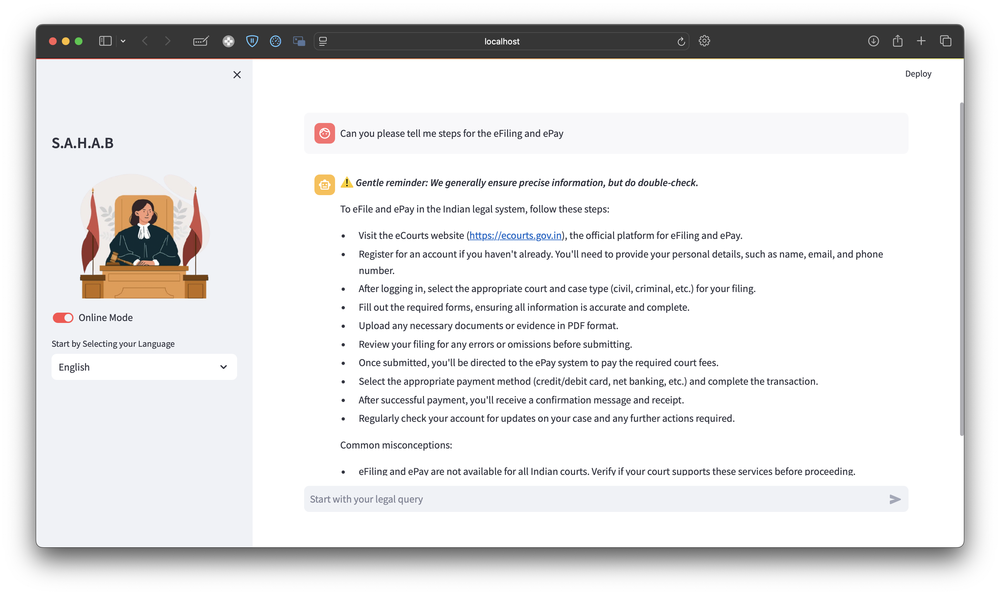

# SAHAB - Smart Automated Hierarchical Analysis Bot

SAHAB is an intelligent legal assistant specializing in the Indian Penal Code. It provides accurate and contextually appropriate responses to legal queries in multiple Indian languages.

<div align="center">
  
  
</div>

## Features

- **Multilingual Support**: Communicate in various Indian languages including English, Hindi, Bengali, and more.
- **AI-Powered Responses**: Utilizes advanced language models to provide accurate legal information.
- **User-Friendly Interface**: Clean and intuitive Streamlit-based UI for easy interaction.
- **Offline Mode**: Option to switch between online and offline modes for flexibility.
- **Conversation Memory**: Maintains context through conversation history.
- **Legal Text Analysis**: Processes and retrieves information from legal documents.

## Demo

Try SAHAB live: [SAHAB Demo](https://sahab-demo.streamlit.app)

## Installation

1. Clone the repository:
   ```
   git clone https://github.com/Sahil-Bhoite/SAHAB.git
   cd SAHAB
   ```

2. Install the required dependencies:
   ```
   pip install -r requirements.txt
   ```

3. Set up your API keys in `config.py`.

## Usage

Run the Streamlit app:

```
streamlit run new.py
```

Navigate to the provided local URL in your web browser to interact with SAHAB.

## Dependencies

- streamlit==1.33.0
- langchain==0.2.16
- langchain_community==0.2.16
- langchain_huggingface==0.0.3
- langchain_together==0.1.5
- faiss-cpu==1.7.4
- deep_translator==1.11.4

For a complete list, see `requirements.txt`.

## Contributing

Contributions to SAHAB are welcome! Please feel free to submit a Pull Request.

## License

This project is licensed under the MIT License - see the [LICENSE](https://github.com/Sahil-Bhoite/SAHAB/blob/main/LICENSE) file for details.

## Contact

Sahil Bhoite - [LinkedIn](https://www.linkedin.com/in/sahil-bhoite/)

Project Link: [https://github.com/Sahil-Bhoite/SAHAB](https://github.com/Sahil-Bhoite/SAHAB)

